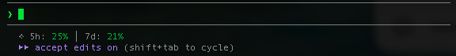

<h1 align="center">claude-quota-statusline</h1>

<p align="center">
  <strong>See your Claude Code quota usage — right in the status bar.</strong>
</p>

<p align="center">
  <a href="https://github.com/codecoincognition/claude-quota-statusline/blob/main/LICENSE"></a>
  
  <a href="https://github.com/codecoincognition/claude-quota-statusline/stargazers"></a>
</p>

<p align="center">
  <a href="#install">Install</a> &middot;
  <a href="#how-it-works">How It Works</a> &middot;
  <a href="#display-modes">Display Modes</a> &middot;
  <a href="#uninstall">Uninstall</a>
</p>

<br>

<p align="center">
  
</p>

<p align="center">
  Shows your quota usage — rolling 5-hour and 7-day windows, updated after every response.<br>
  <code>⟡ 5h: 60% │ 7d: 20%</code><br><br>
  🟢 Green (&lt;80%) &middot; 🟡 Yellow (80-94%) &middot; 🔴 Red (95%+)<br>
  Text mode (default) or <a href="#display-modes">visual progress bars</a>
</p>

<br>

---

<br>

## Install

### One-liner (recommended)

```bash
curl -fsSL https://raw.githubusercontent.com/codecoincognition/claude-quota-statusline/main/install.sh | bash
```

This downloads the script to `~/.claude/`, installs `jq` if needed, and patches your `settings.json`.

<br>

<details>
<summary><strong>Manual install</strong></summary>

<br>

**1. Clone and copy the script:**

```bash
git clone https://github.com/codecoincognition/claude-quota-statusline.git
cd claude-quota-statusline
cp quota-statusline.sh ~/.claude/
chmod +x ~/.claude/quota-statusline.sh
```

**2. Add to `~/.claude/settings.json`:**

```json
"statusLine": {
  "type": "command",
  "command": "bash ~/.claude/quota-statusline.sh"
}
```

**3. Restart Claude Code.**

</details>

<br>

Then **restart Claude Code** (both methods).

> Want visual progress bars? Add `--mode bar` — see <a href="#display-modes">Display Modes</a>.

<br>

> **Requirements:** macOS &middot; [Claude Code](https://docs.anthropic.com/en/docs/claude-code) (Pro or Max subscription) &middot; `jq` (auto-installed via Homebrew if missing)

<br>

---

<br>

## How It Works

Claude Code's `statusLine` feature pipes JSON to a configured command after each assistant response. The JSON includes `rate_limits.five_hour.used_percentage` and `rate_limits.seven_day.used_percentage`.

By default, the script displays **color-coded percentages** for both quota windows:

```
⟡ 5h: 67% │ 7d: 20%
```

You can also switch to a **visual progress bar** mode (`--mode bar`) that renders a 10-block bar alongside the percentage:

```
⟡ 5h: ███████░░░ 67% │ 7d: ██░░░░░░░░ 20%
```

Both modes use ANSI color coding based on usage:

| Usage | Color | Text | Bar |
|-------|-------|------|-----|
| < 80% | 🟢 Green | `67%` | `███████░░░` |
| 80-94% | 🟡 Yellow | `82%` | `████████░░` |
| 95%+ | 🔴 Red | `98%` | `██████████` |

Before the first API response in a session, the status bar shows `⟡ quota: waiting…`.

> **Note:** API key users won't see quota data — the `rate_limits` field is only present for Claude.ai subscribers.

<br>

---

<br>

## Display Modes

The script supports two display modes via the `--mode` flag:

| Mode | Flag | Example |
|------|------|---------|
| **Text** (default) | none | `⟡ 5h: 67% │ 7d: 20%` |
| **Bar** | `--mode bar` | `⟡ 5h: ███████░░░ 67%` |

No flag needed for text mode — it's the default.

To enable the progress bar, update the `command` in `~/.claude/settings.json`:

```json
"statusLine": {
  "type": "command",
  "command": "bash ~/.claude/quota-statusline.sh --mode bar"
}
```

Then restart Claude Code.

<br>

---

<br>

## Uninstall

```bash
bash <(curl -fsSL https://raw.githubusercontent.com/codecoincognition/claude-quota-statusline/main/uninstall.sh)
```

<details>
<summary><strong>Manual uninstall</strong></summary>

<br>

```bash
rm ~/.claude/quota-statusline.sh
```

Remove the `statusLine` key from `~/.claude/settings.json`, then restart Claude Code.

</details>

<br>

---

<br>

<p align="center">
  <sub>Built by <a href="https://github.com/codecoincognition">Code Coin Cognition LLC</a></sub>
</p>
